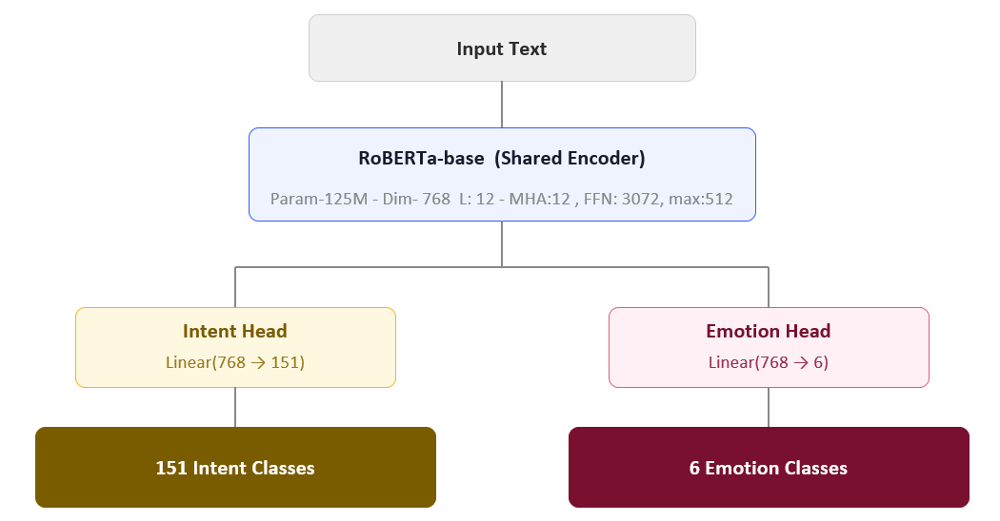
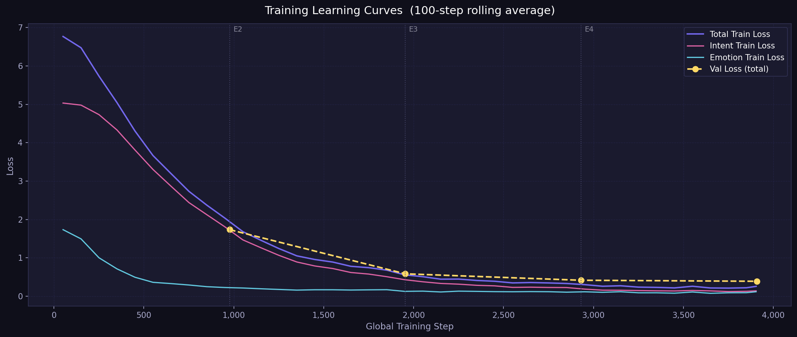
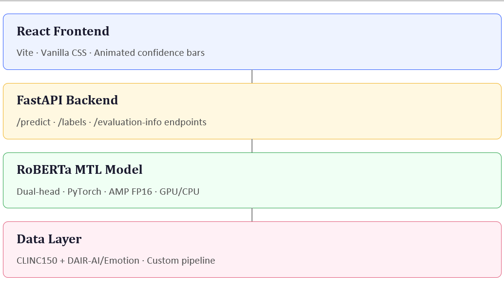

# Multi-Task Learning Pipeline: Intent & Emotion Classification


A deep learning system that simultaneously classifies **user intent** and **emotion** from text, powered by a dual-head RoBERTa transformer — served through a FastAPI backend and a modern React web interface. 
This is my Semester Project for Advanced Generative Computing Systems, supervised by Dr. Benish Amin at the Institute of Space Technology Islamabad.

---

## Overview

Traditional NLP pipelines treat intent detection and emotion classification as separate problems. This project explores **Multi-Task Learning (MTL)** — a paradigm where a single shared Transformer encoder learns both tasks jointly, exploiting the semantic overlap between *what a user wants* and *how they feel*. The result is a single inference pass that produces two rich labels, enabling richer understanding of customer interactions.

---

## Architecture



- **Shared Encoder:** `roberta-base` (125M parameters), frozen bottom layers optional
- **[CLS] Pooler Output** feeds into both classification heads
- **Joint Loss:** Sum of two independent Cross-Entropy losses, one per head
- **Mixed Precision:** AMP/FP16 training for efficiency on consumer GPUs

---

## Datasets

| Dataset | Task | Classes | Samples |
|---|---|---|---|
| [CLINC150](https://www.kaggle.com/datasets/hongtrung/clinc150-dataset) | Intent Detection | 151 | ~23,700 |
| [DAIR-AI/Emotion](https://huggingface.co/datasets/dair-ai/emotion) | Emotion Classification | 6 | ~20,000 |

A custom pipeline (`create_dataset.py`) logically combines these two datasets, assigning every text sample a valid Intent label and an Emotion label. A validation script (`validate_dataset.py`) checks class distributions and structural integrity before training begins.

---

## Dataset Statistics

```text
============================================================
1. ORIGINAL DATASETS DISTRIBUTION (All splits combined)
============================================================

[DAIR-AI/Emotion Class Distribution]
  joy             : 6,761
  sadness         : 5,797
  anger           : 2,709
  fear            : 2,373
  love            : 1,641
  surprise        : 719


[CLINC150 (Intent) Class Distribution (Top 10 & Bottom 10)]
  42                        : 1,350
  89                        : 150
  2                         : 150
  21                        : 150
  137                       : 150
  37                        : 150
  19                        : 150
  112                       : 150
  70                        : 150
  31                        : 150
  ... (skipping middle classes)
  107                       : 150
  149                       : 150
  74                        : 150
  65                        : 150
  76                        : 150
  119                       : 150
  98                        : 150
  30                        : 150
  132                       : 150
  51                        : 150

============================================================
2. GENERATED MTL DATASETS (Train/Validation/Test)
============================================================
  Train Dataset      : 31,250 samples
  Validation Dataset : 5,100 samples
  Test Dataset       : 7,500 samples
-----------------------------------
  Total              : 43,850 samples

============================================================
3. TRAINING SET CLASS DISTRIBUTION
============================================================

[Total Samples by Task]
  Intent Samples  : 15,250
  Emotion Samples : 16,000

[Training Set - Emotion Class Counts]
  joy             : 5,362
  sadness         : 4,666
  anger           : 2,159
  fear            : 1,937
  love            : 1,304
  surprise        : 572

[Training Set - Intent Class Counts (Top 10 & Bottom 10)]
  oos                       : 250
  shopping_list_update      : 100
  smart_home                : 100
  change_speed              : 100
  meeting_schedule          : 100
  current_location          : 100
  account_blocked           : 100
  taxes                     : 100
  weather                   : 100
  pay_bill                  : 100
  ... (skipping middle classes)
  pin_change                : 100
  traffic                   : 100
  measurement_conversion    : 100
  restaurant_reviews        : 100
  new_card                  : 100
  distance                  : 100
  interest_rate             : 100
  yes                       : 100
  mpg                       : 100
  transfer                  : 100
```

## Results

| Metric | Score |
|---|---|
| **Intent Accuracy** | **89.04%** |
| Intent Macro F1 | 0.9189 |
| **Emotion Accuracy** | **92.70%** |
| Emotion Macro F1 | 0.8824 |
| Combined Score | 0.8864 |

Training was performed for **4 epochs** on an **NVIDIA RTX 2080 (8GB VRAM)** using FP16 mixed precision.

### Learning Curves



### Experiment Comparison: GoEmotions vs DAIR-AI/Emotion

Initially, the model was trained using the **GoEmotions** dataset (28 classes). We then switched to the **DAIR-AI/Emotion** dataset (6 classes) to balance the data distribution alongside the CLINC150 dataset and simplify the emotion taxonomy. This architectural shift resulted in a massive performance boost for emotion classification.

#### Dataset Composition

**Experiment 1 (CLINC150 + GoEmotions)**
- **Train:** 58,660 samples (15,250 Intent + 43,410 Emotion)
- **Validation:** 8,526 samples (3,100 Intent + 5,426 Emotion)
- **Test:** 10,927 samples (5,500 Intent + 5,427 Emotion)

**Experiment 2 (CLINC150 + DAIR-AI/Emotion)**
- **Train:** 31,250 samples (15,250 Intent + 16,000 Emotion)
  - *Intent Distribution:* Perfectly balanced (100 samples per standard class, 250 for `oos`).
  - *Emotion Distribution:* `joy` (5,362), `sadness` (4,666), `anger` (2,159), `fear` (1,937), `love` (1,304), `surprise` (572).
- **Validation:** 5,100 samples (3,100 Intent + 2,000 Emotion)
- **Test:** 7,500 samples (5,500 Intent + 2,000 Emotion)

#### Performance Comparison

| Metric | Exp 1 (GoEmotions) | Exp 2 (DAIR-AI) | Improvement |
|---|---|---|---|
| **Intent Accuracy** | 89.65% | 89.04% | -0.61% |
| **Intent Macro F1** | 0.9219 | 0.9189 | -0.0030 |
| **Emotion Accuracy** | 57.79% | **92.70%** | **+34.91%** |
| **Emotion Macro F1** | 0.4667 | **0.8824** | **+0.4157** |
| **Combined Score** | 0.6816 | **0.8864** | **+0.2048** |

---

## Training Hyperparameters

| Parameter | Value |
|---|---|
| Base Model | `roberta-base` |
| Epochs | 4 |
| Batch Size | 32 |
| Learning Rate | 2e-5 |
| Max Token Length | 128 |
| Optimizer | AdamW |
| LR Scheduler | Linear warmup (10%) |
| Loss Function | CrossEntropyLoss (joint sum) |
| Mixed Precision | AMP FP16 |

---

## Project Structure

```
Project/
│
├── backend/                    # FastAPI backend API
│   ├── main.py                 # /predict, /labels, /evaluation-info endpoints
│   └── requirements.txt        # Backend dependencies
│
├── frontend/                   # React + Vite web UI
│   └── src/
│       ├── App.jsx             # Main application
│       ├── index.css           # Elegant cream paper theme
│       └── components/
│           ├── PredictionCard.jsx  # Animated result display
│           └── InfoModal.jsx       # InfoGraphics modal
│
├── data/
│   ├── custom_mtl_dataset_csv/ # Generated dataset (train / validation splits)
│   └── label_maps/             # intent_labels.csv, emotion_labels.csv
│
├── evaluation/
│   ├── learning_curves.png     # Training & validation loss/accuracy plots
│   └── evaluation_summary.csv  # Aggregated evaluation metrics
│
├── models/
│   ├── best_model.pt           # Best model checkpoint (saved by validation loss)
│   └── last_checkpoint.pt      # Latest checkpoint for resuming training
│
├── architecture.png            # Model architecture diagram
├── system.png                  # System tech stack diagram
├── model.py                    # MultiTaskRoBERTa architecture
├── dataset.py                  # PyTorch Dataset class & DataLoaders
├── create_dataset.py           # Dataset combination pipeline
├── validate_dataset.py         # Dataset health checks
├── dataset_stats.py            # Dataset statistics generator
├── dataset_stats_output.txt    # Output file containing dataset stats
├── train.py                    # Training loop with AMP & checkpointing
├── evaluate.py                 # Full evaluation with per-class reports
├── inference.py                # CLI inference script
├── download_model.py           # Script to download pre-trained weights
├── evaluation.txt              # Detailed per-class evaluation report
├── MileStones.md               # Project milestones document
├── project.md                  # Additional project documentation
└── Project Proposal.docx       # Original project proposal document
```

---

## Getting Started

### Prerequisites

- Python 3.10+
- CUDA-capable GPU (recommended, CPU fallback supported)
- Node.js 18+ and npm
- `conda` (optional, but recommended)

### 1. Clone & Set Up Environment

```bash
# Create and activate environment
conda create -n mypy python=3.10
conda activate mypy
```

### 2. Install Python Dependencies

```bash
# Backend dependencies
pip install -r backend/requirements.txt
```

### 3. Prepare the Dataset

```bash
# Generate the combined MTL dataset from CLINC150 + DAIR-AI/Emotion
python create_dataset.py

# Validate the generated dataset
python validate_dataset.py
```

### 4. Train the Model

```bash
python train.py
```

Training will save `models/best_model.pt` (best validation loss) and `models/last_checkpoint.pt` (for resuming). To resume from a checkpoint, simply re-run `python train.py` — it will detect the checkpoint automatically.

### 5. Evaluate the Model

```bash
python evaluate.py
```

This generates `evaluation/evaluation_summary.csv`, `evaluation/learning_curves.png`, and the full `evaluation.txt` report.

### 6. CLI Inference

```bash
python inference.py
```

You will be prompted to enter any text. The model will output the predicted Intent and Emotion with confidence scores.

```
> Enter text: I need help tracking my package

  Intent  : track_package  (97.3%)
  Emotion : fear  (62.1%)
```

### 7. Run the Web Application

**Terminal 1 — Start Backend:**
```bash
uvicorn backend.main:app --reload
```
The API will be available at `http://localhost:8000`.

**Terminal 2 — Start Frontend:**
```bash
cd frontend
npm install
npm run dev
```
Open `http://localhost:5173` in your browser.

---

## Web Application Features

- **📝 Text Analysis** — Enter any text review and receive dual predictions instantly
- **📊 Confidence Scores** — Animated progress bars display prediction confidence
- **🏷️ Label Reference** — Scrollable side-by-side lists of all 151 Intent and 6 Emotion labels
- **📈 InfoGraphics Modal** — View training config, datasets, evaluation scores, learning curves, and the detailed classification report — all accessible via the top-right button

---

## API Endpoints

| Method | Endpoint | Description |
|---|---|---|
| `POST` | `/predict` | Run inference on input text |
| `GET` | `/labels` | List all intent & emotion label names |
| `GET` | `/evaluation-info` | Get training config, datasets & metrics |
| `GET` | `/evaluation/learning_curves.png` | Serve the training curves image |

**Example Request:**
```bash
curl -X POST http://localhost:8000/predict \
  -H "Content-Type: application/json" \
  -d '{"text": "I am really frustrated with this broken product"}'
```

**Example Response:**
```json
{
  "intent": "complaint",
  "intent_confidence": 0.891,
  "emotion": "anger",
  "emotion_confidence": 0.743
}
```

---

## Hardware & Performance

- **Training Hardware:** NVIDIA RTX 2080 8GB VRAM
- **Training Precision:** FP16 (Automatic Mixed Precision)
- **Inference:** GPU (CUDA) or CPU fallback
- **Training Time:** ~5 epochs on the combined dataset

---

## Tech Stack



| Layer | Technology |
|---|---|
| Model | PyTorch, HuggingFace Transformers (`roberta-base`) |
| Dataset | HuggingFace Datasets (CLINC150, DAIR-AI/Emotion) |
| Backend API | FastAPI, Uvicorn, Pydantic |
| Frontend | React 18, Vite, Vanilla CSS |
| Evaluation | Scikit-learn, Matplotlib |


## Acknowledgments

I would like to express my gratitude to Dr. Benish Amin for her guidance and support throughout this project.

## License

This is a gift from the Institute of Space Technology Islamabad, to the AI community. 
Developed by Ubaid Ur Rehman.
